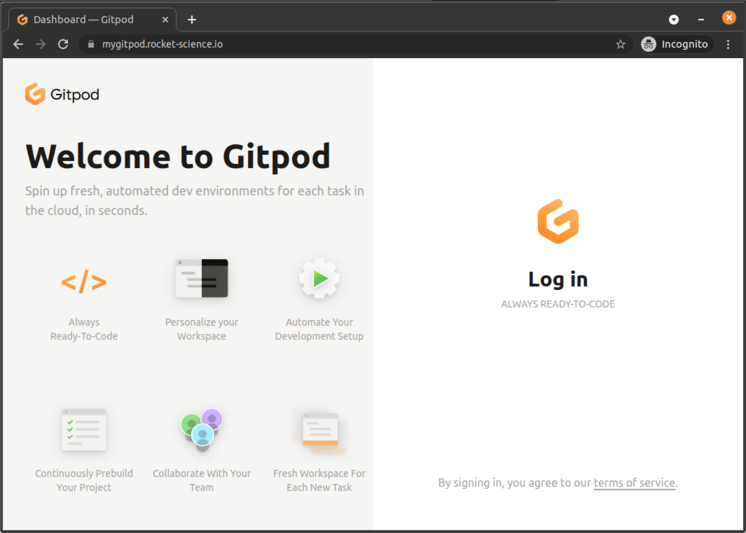

# Running Gitpod in [Amazon EKS](https://aws.amazon.com/en/eks/)

## Provision an EKS cluster

Before starting the installation process, you need:

- An AWS account with Administrator access
  - [Create one now by clicking here](https://aws.amazon.com/getting-started/)
- A SSL Certificate created with [AWS Certificate Manager](https://aws.amazon.com/en/certificate-manager/)
- AWS credentials set up. By default, those configs are present in `$HOME/.aws/`.
- [eksctl](https://eksctl.io/) config file describing the cluster.
  - Here is an [eks-cluster.yaml](eks-cluster.yaml) you can use as example.
- A `.env` file with basic details about the environment.
  - We provide an example of such file [here](.env.example).
- [Docker](https://docs.docker.com/engine/install/) installed on your machine, or better, a Gitpod workspace :)

### Choose an Amazon Machine Image (AMI)

Please update the `ami` field in the [eks-cluster.yaml](eks-cluster.yaml) file with the proper AMI ID for the region of the cluster.

| Region       | AMI                   |
| ------------ | --------------------- |
| us-west-1    | ami-01395176fa1eb01d5 |
| us-west-2    | ami-0caaf47ba5933e634 |
| eu-west-1    | ami-0326129cb2b886811 |
| eu-west-2    | ami-04e6042175e0d2d6d |
| eu-central-1 | ami-0b0ec4e6ca9e9bcc8 |
| us-east-1    | ami-036c96c896363b47b |
| us-east-2    | ami-0209a4d29962f060c |

**To start the installation, execute:**

```shell
make install
```

The whole process takes around forty minutes. In the end, the following resources are created:

- an EKS cluster running Kubernetes v1.20
- Kubernetes nodes using a custom [AMI image](https://github.com/gitpod-io/amazon-eks-custom-amis/tree/gitpod):
  - Ubuntu 20.04
  - Linux kernel v5.12
  - containerd v1.54
  - runc: v1.0.1
  - CNI plugins: v0.9.1
  - Stargz Snapshotter: v0.7.0

- ALB load balancer with TLS termination and re-encryption
- RDS Mysql database
- Two autoscaling groups, one for gitpod components and another for workspaces
- In-cluster docker registry using S3 as storage backend
- IAM account with S3 access (docker-registry and gitpod user content)
- [calico](https://docs.projectcalico.org) as CNI and NetworkPolicy implementation
- [cert-manager](https://cert-manager.io/) for self-signed SSL certificates
- [cluster-autoscaler](https://github.com/kubernetes/autoscaler/tree/master/cluster-autoscaler)
- [Jaeger operator](https://github.com/jaegertracing/helm-charts/tree/main/charts/jaeger-operator) - and Jaeger deployment for gitpod distributed tracing
- [metrics-server](https://github.com/kubernetes-sigs/metrics-server)
- [gitpod.io](https://github.com/gitpod-io/gitpod) deployment

## Verify the installation

First, check that Gitpod components are running.

```shell
kubectl get pods
NAME                               READY   STATUS    RESTARTS   AGE
blobserve-6bdb9c7f89-lvhxd         2/2     Running   0          6m17s
content-service-59bd58bc4d-xgv48   1/1     Running   0          6m17s
dashboard-6ffdf8984-b6f7j          1/1     Running   0          6m17s
image-builder-5df5694848-wsdvk     3/3     Running   0          6m16s
jaeger-8679bf6676-zz57m            1/1     Running   0          4h28m
messagebus-0                       1/1     Running   0          4h11m
proxy-56c4cdd799-bbfbx             1/1     Running   0          5m33s
registry-6b75f99844-bhhqd          1/1     Running   0          4h11m
registry-facade-f7twj              2/2     Running   0          6m12s
server-64f9cf6b9b-bllgg            2/2     Running   0          6m16s
ws-daemon-bh6h6                    2/2     Running   0          2m47s
ws-manager-5d57746845-t74n5        2/2     Running   0          6m16s
ws-manager-bridge-79f7fcb5-7w4p5   1/1     Running   0          6m16s
ws-proxy-7fc9665-rchr9             1/1     Running   0          5m57s
```

TODO: add additional `kubectl log` commands

### Test Gitpod workspaces

When the provisioning and configuration of the cluster is done, the script shows the URL of the load balancer,
like:

```shell
Load balancer hostname: k8s-default-gitpod-.......elb.amazonaws.com
```

This is the value of the `CNAME` field that needs to be configured in the DNS domain, for the record `<domain>`, `*.ws.<domain>` and `*.<domain>`

After these three records are configured, please open the URL `https://<domain>/workspaces`.
It should display the gitpod login page similar to the next image.

> If the property `ROUTE53_ZONEID` is enabled in the .env file, we install [external-dns](https://github.com/kubernetes-sigs/external-dns) and such update is not required



----

## Update Gitpod auth providers

Please check the [OAuth providers integration documentation](https://www.gitpod.io/docs/self-hosted/0.5.0/install/oauth) expected format.

We provide an [example here](./auth-providers-patch.yaml). Fill it with your OAuth providers data.

```console
make auth
```

> We are aware of the limitation of this approach, and we are working to improve the helm chart to avoid this step.

## Destroy the cluster and AWS resources

Remove Cloudformation stacks and EKS cluster running:

```shell
make uninstall
```

> The command asks for a confirmation:
> `Are you sure you want to delete: Gitpod, Services/Registry, Services/RDS, Services, Addons, Setup (y/n)?`

> Please make sure you delete the S3 bucket used to store the docker registry images!
